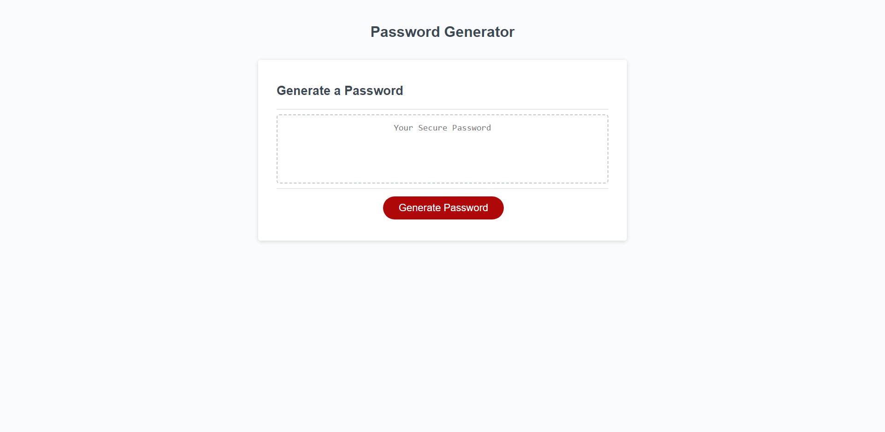

# John Kang, Challenge 3; Password Generator
The purpose of this assigment was to create a random password generator using JavaScript. This application will genreate a password based on different criterias that the user selects.
The password length has to be between 8 and 128 characters and needs to use at least one type of character for the application to work. 

## Screenshot of deployed website 
 

### Deployed Site 
https://jyk33.github.io/Creating-a-portfolio/